<h1 align="center">
  <a href="https://github.com/CommunityOfCoders/Inheritance2k25">
    CoC Inheritance 2025
  </a>
  <br>
  AIthentic: Military-Grade Neural Forensics
</h1>

<div align="center">
  By <strong>Team CodePagloos</strong>
</div>
<hr>

<details>
<summary><strong>Table of Contents</strong> (Click to Expand)</summary>

- [📝 Description](#-description)
- [🔗 Links](#-links)
- [🤖 Tech-Stack](#-tech-stack)
- [🏗️ System Architecture](#-system-architecture)
- [📈 Progress](#-progress)
- [🔮 Future Scope](#-future-scope)
- [💸 Applications](#-applications)
- [🛠 Project Setup](#-project-setup)
- [👨‍💻 Team Members](#-team-members)
- [👨‍🏫 Mentors](#-mentors)

</details>

<a name="-description"></a>
## 📝 Description

**AIthentic** is an enterprise-grade forensic platform designed to expose Deepfake media by analyzing temporal inconsistencies invisible to the human eye. Unlike traditional detectors that analyze static frames, our system uses **Active Entropy Sampling** to target high-motion segments and employs a **Hybrid Spatial-Temporal Network (EfficientNet-B3 + Bi-LSTM)** to detect micro-flickers and warping artifacts.

The platform achieves **96.71% accuracy** and features a cyber-forensic dashboard with a live neural terminal and an integrated AI assistant.

<a name="-links"></a>
## 🔗 Links

- [GitHub Repository](https://github.com/sahil1399m/AI_DEEPFAKE_FINAL_MODEL)
- [Demo Video](https://raw.githubusercontent.com/sahil1399m/AI_DEEPFAKE_FINAL_MODEL/main/demo_video_for_project.mp4)
- [Project Screenshots]([INSERT_YOUR_DRIVE_LINK])
- [Hosted Website](https://aideepfakefinalmodel-8klv8esicpxfjwcq3b7jjj.streamlit.app/)

<a name="-tech-stack"></a>
## 🤖 Tech-Stack

* **Language:** Python 3.10+
* **Deep Learning:** PyTorch, Torchvision
* **Model Architectures:**
    * `EfficientNet-B3` (Spatial Feature Extraction)
    * `Bi-Directional LSTM` (Temporal Sequence Modeling)
    * `MTCNN` (Face Detection)
* **Computer Vision:** OpenCV, PIL, Active Entropy Algorithms
* **Frontend/UI:** Streamlit, Custom CSS (Cyberpunk/SOC Theme), Plotly (Telemetry)
* **GenAI:** Google Gemini 1.5 Flash API (Forensic Assistant)
* **Data Handling:** NumPy, Pandas

<a name="-system-architecture"></a>
## 🏗️ System Architecture

Our architecture combines spatial feature extraction with temporal sequence analysis to detect anomalies that occur over time, not just in single frames.

```mermaid
graph LR
    %% --- STYLE DEFINITIONS ---
    classDef user fill:#000,stroke:#fff,stroke-width:2px,color:#fff;
    classDef frontend fill:#0f172a,stroke:#38bdf8,stroke-width:2px,color:#38bdf8;
    classDef process fill:#000,stroke:#2979ff,stroke-width:2px,color:#2979ff,stroke-dasharray: 5 5;
    classDef model fill:#1a1a2e,stroke:#d946ef,stroke-width:2px,color:#d946ef;
    classDef db fill:#000,stroke:#fbbf24,stroke-width:2px,color:#fbbf24;
    classDef ext fill:#2e1065,stroke:#a855f7,stroke-width:2px,color:#fff;
    classDef alert fill:#450a0a,stroke:#ff1744,stroke-width:2px,color:#fff;
    classDef safe fill:#064e3b,stroke:#00ff41,stroke-width:2px,color:#fff;

    %% --- NODES ---
    
    subgraph CLIENT [💻 CLIENT LAYER]
        direction TB
        U((👤 User)):::user
        UI["🖥️ Streamlit UI"]:::frontend
        CHAT["💬 AI Help"]:::ext
    end

    subgraph PRE [⚙️ PRE-PROCESSING]
        direction TB
        V_IN["📹 Video"]:::process
        ENTROPY("⚡ Entropy Scan"):::process
        MTCNN{"👤 Face Detect"}:::process
        CROP["✂️ Crop 224px"]:::process
    end

    subgraph BRAIN [🧠 AI MODEL]
        direction TB
        ENET["👁️ EfficientNet"]:::model
        LSTM["🧠 Bi-LSTM"]:::model
    end

    subgraph DECISION [🛡️ VERDICT]
        direction TB
        SCORE["📊 Score"]:::db
        FAKE["⚠️ DEEPFAKE"]:::alert
        REAL["✅ REAL"]:::safe
    end

    %% --- CONNECTIONS ---
    U --> UI
    UI <--> CHAT
    UI --> V_IN
    
    V_IN --> ENTROPY
    ENTROPY --> MTCNN
    MTCNN --> CROP
    CROP --> ENET
    
    ENET --> LSTM
    LSTM --> SCORE
    
    SCORE -- "> 0.5" --> FAKE
    SCORE -- "< 0.5" --> REAL
    
    FAKE --> UI
    REAL --> UI

```



<a name="-progress"></a>
## 📈 Progress

### Fully Implemented Features
* **Active Entropy Sampling:** Successfully filters 90% of useless background frames to optimize inference speed (~2.5s per video).
* **Hybrid Detection Core:** The EfficientNet-B3 + Bi-LSTM architecture is fully trained and verified with **96.71% Test Accuracy**.
* **Forensic Dashboard:** A complete UI with "Bouncer" logic visualizations, file upload, and real-time "Live Terminal" logs.
* **Gemini Assistant:** Integrated chatbot that explains forensic verdicts (e.g., "Why is this fake?") to non-technical users.

### Partially Implemented Features / Work in Progress
* **Granular Artifact Reporting:** Currently, the system gives a binary "Real vs. Fake" verdict. We are refining the backend to generate a detailed breakdown that specifies *why* it is fake (e.g., "Lighting Mismatch detected" vs. "Lip Sync Error detected").
* **Robustness to Compression:** The model performs best on high-quality footage (720p+). We are currently fine-tuning the weights on a dataset of highly compressed videos to ensure it remains accurate even on low-quality social media clips (like WhatsApp forwards).


<a name="-future-scope"></a>
## 🔮 Future Scope
* **Audio-Visual Sync:** Integration of Wav2Lip-based models to detect desynchronization between lip movements and audio.
* **Adversarial Defense:** Training against "anti-forensic" noise attacks (Gaussian blur/compression).
* **Browser Extension:** Lightweight plugin to flag synthetic media on X/Twitter in real-time.

<a name="-applications"></a>
## 💸 Applications
1. **Legal & Judiciary:** Authenticating video evidence in court to prevent tampering.
2. **News & Media:** Verifying political speeches and breaking news footage before broadcast.
3. **Digital Identity (KYC):** Detecting "virtual camera" injection attacks during remote video verification.

<a name="-project-setup"></a>
## 🛠 Project Setup

#### 1. Clone the Repository
```bash
git clone https://github.com/sahil1399m/AI_DEEPFAKE_FINAL_MODEL
cd AIthentic
```
#### 2. Install Dependencies
```bash
pip install -r requirements.txt
```
#### 3. Run the Application
```bash
streamlit run app.py
```

<a name="-team-members"></a>
## 👨‍💻 Team Members

* **Sahil Desai:** [GitHub Profile](https://github.com/sahil1399m)
* **Himanshu:** [GitHub Profile](https://github.com/himanshu-codes-ai)
* **Tejas:** [GitHub Profile](https://github.com/Tejas-coder-cloud)
* **Krish:** [GitHub Profile](https://github.com/SahilDesai-0)

<a name="-mentors"></a>
## 👨‍🏫 Mentors

* **Abhishek Kotwani:** [GitHub/LinkedIn](https://www.linkedin.com/in/abhishek-kotwani?utm_source=share_via&utm_content=profile&utm_medium=member_android)
* **Om Mukherjee:** [GitHub/LinkedIn](https://www.linkedin.com/in/om-mukherjee7?utm_source=share_via&utm_content=profile&utm_medium=member_android)

